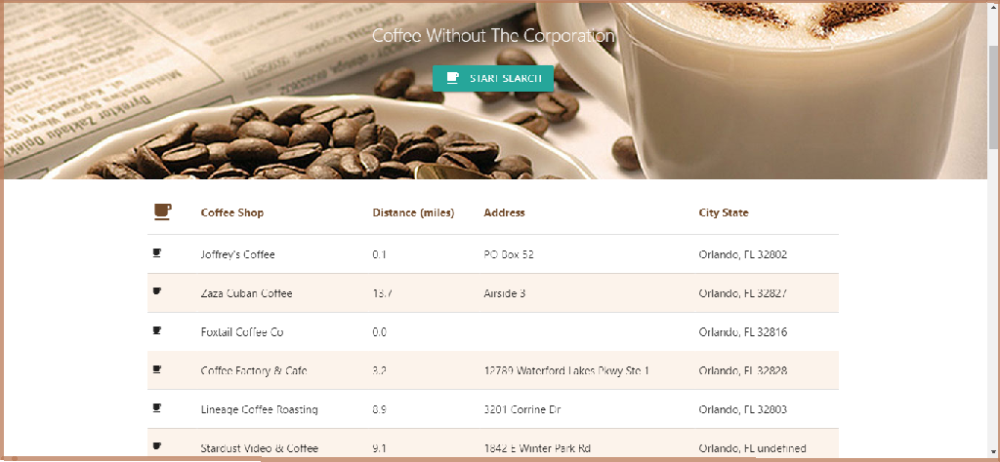
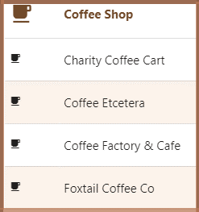
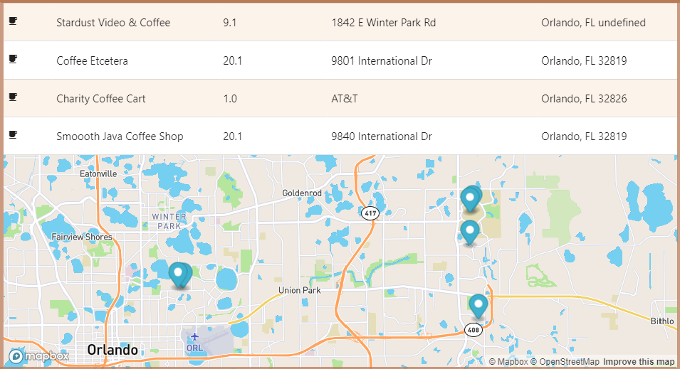

# NotSTARBUCKS

## Coffee without the Corporations

The idea for this coffee finder app was born from team member, Jessica Friday, after she visited a couple of local coffee shops for study group.  She realized that many people first think of Starbucks, but knows that not everyone wants to go to that one shop.  The shops she visited were unique.  That’s what we believe people prefer.

Local coffee shops offer an experience that the big corporate shops don’t have, but they can be difficult to find if you are on vacation or moving to a new location.  All users need to do is enter their city & state or zip code and this app will find local coffee shops with ratings and info to help users find that unique cup and experience, while excluding Starbucks.

## Using HTML5 Geolocation API, the user's location is determined and local coffee shop results are turned via Foursquare API.  The results are displayed with name, distance and address. 
 
 

## Results can be sorted by name or distance. 
 
 

## Results are displayed on the map via Mapbox API. 
 

